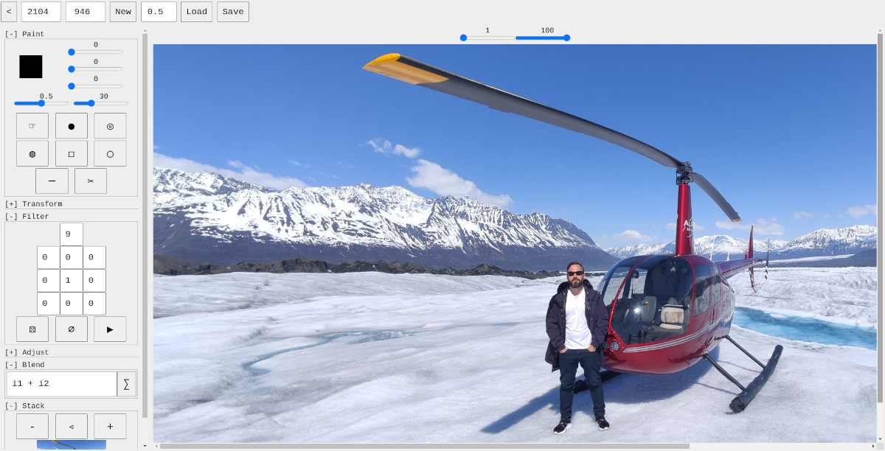

# Custom Filter
A image editor that runs in the browser

[live version](https://victorribeiro.com/customFilter)

## About

As the name suggests, this project came about after some experiments running custom [filters](https://ai.stanford.edu/~syyeung/cvweb/tutorial1.html)
on images. The next best thing this editor allows you to do is to run custom [blend](https://en.wikipedia.org/wiki/Blend_modes) equations on multiple
images at once.

## Videos

Here are some videos on the editor features and how to use them.  
[https://www.youtube.com/playlist?list=PL3pnEx5_eGm9rVr1_u1Hm_LK6sx4QrXzK](https://www.youtube.com/playlist?list=PL3pnEx5_eGm9rVr1_u1Hm_LK6sx4QrXzK)
